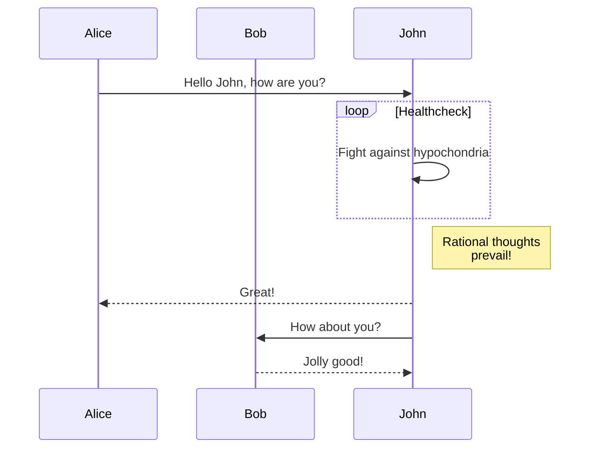



---

## Prerequisites

This documentation was built with beginners in mind, but has the necessary information for more seasoned producers.

To install and use Ed you will be using your terminal. If you need a refresher, I highly recommend "The Command Line Crash Course". Working knowledge of HTML and CSS is also taken for granted. If you're new to HTML and CSS, you may want to check out the relevant courses on codecademy.com.

---

## Installing Ed

Before starting, please be sure that you have installed Hugo and created a new site. After that, you are ready to install Ed.

Please note, to install Ed, you must have Go >= 1.12 installed on your computer. You probably have Go already, but if you don't, the easiest way is probably to install is to follow Go installation instruction. To check if Go is running on your system enter the following line on your terminal (remember to ignore the `$`):

```bash
$ go version
```

If you don't get an error, you're good to go. Using the `cd` command on your terminal, navigate to the folder where you keep your web projects. Once you're in the folder where project live, initialize the Hugo Modules system using the following line (replace `<your_user>` and `<your_project>` by real names):

*Note: If you have already initialized Hugo Modules for your site, you can skip this step.*

```bash
$ hugo mod init github.com/<your_user>/<your_project>
```

If you haven't run this command before, your terminal output should
look similar to the following:

```
go: creating new go.mod: module github.com/<your_user>/<your_project>
go: to add module requirements and sums:
    go mod tidy
```

Take a look inside the `exampleSite` folder of the Ed theme. You'll find a file called `hugo.toml`. Copy this file in the root directory of your Hugo site. After copying, review the contents of this file and adjust the settings according to your project's needs.

By default, when you copy configuration file to the root of your Hugo site, it should contain the following lines:

```toml
[module]
  # ...
  # there might be additional settings here
  # that are not relevant at the moment
  # ...
  [[module.imports]]
    path = 'github.com/sergeyklay/gohugo-theme-ed'
```

If these lines are missing for some reason, make sure to add them:

```toml
[module]
  [[module.imports]]
    path = 'github.com/sergeyklay/gohugo-theme-ed'
```

Finally, install Hugo Modules using the following command (remember you can copy and paste):

```bash
$ hugo mod get
```

Your terminal output should look similar to the following:

```
go: no module dependencies to download
go: downloading github.com/sergeyklay/gohugo-theme-ed v0.8.0
go: added github.com/sergeyklay/gohugo-theme-ed v0.8.0
hugo: downloading modules …
hugo: collected modules in 5342 ms
```

---

## Getting started

After installing the theme successfully it requires a just a few more steps to get your site running.

If you create a new Hugo project, the `content` folder is blank by default. You can copy the `content` folder from `exampleSite/content` to the project root directory to preview.

To see if Ed is working properly we will take advantage of Hugo's built in server. You can build the first version of your site and run the Hugo server at the same time by entering:

```bash
$ hugo server
```

Copy the url from your terminal log and paste it into your browser of choice. This url usually looks something like this `http://localhost:1313`. At this point you should be looking at your very own working version of Ed:



---

## Hugo

Ed is a Hugo theme. That means you will need some familiarity with Hugo to take advantage of its full potential. While running a Hugo site is a bit more involved than Wordpress and other similar tools, the payoff in the long term is worth the effort to learn it. If you are new to Hugo, I recommend you take a look at A Guide to Using Hugo at *Strapi*, Host on GitHub on *Hugo Documentation Site* and Hugo's own documentation to start getting a sense of how it works.

Once you have gone through these tutorials, you can get started using Ed. Remember to always and only edit content files for your site using a plain text editor, and *not* a word processor. I'm composing this file using a plain text editor called Visual Studio Code.

You should make sure that all your texts have the YAML Front Matter (the information at the top of the file). YAML stands for "YAML Ain't Markup Language" --- no disrespect to XML --- and it's the main way that Hugo handles named data. Here's an example of YAML Front Matter:

```yaml
---
# Common-Defined params
title: "Cahier d'un retour au pays natal"
draft: true # Is this text a draft?
tags:
  - Tag
  - "Another tag"
date: 2022-02-01T14:56:58+02:00
lastmod: 2022-05-01T14:56:58+02:00

# Theme-Defined params
author: Aimé Césaire # Author of the text
editor: Alex Gil # Editor of the text
source: Project Guttenberg # The source of the text
rights: Public Domain # Rights for this text
pageTitle: Hello! # The title for the content w/o setting <title> tag
toc: true # Enable Table of Contents for specific page
private: true # Hide text from search engines
semanticType: about # Semantic type of the work (used for Schema.org)
featuredImage: screenshot-home.png # Featured image of the text

---
```

For more information about all available standard front matter variables, please read Hugo Front Matter.

---

## Must-resolve issues

* hamburger menu is not positioned perfectly
* sidebar can't be closed by swipe
* sidebar can't be dismissed by tapping outside it, e.g. on the main content
* there is a strange bug with `[id]::before` CSS rule on the RSS feed button, it becomes very big?
* when sidebar is open, content should fade, maybe with blurring dark overlay?
* top bar image has unnecessary right padding
* warning, error, note, alert, etc within the content
* "universal sign off" at the bottom of the content, e.g. "I'm John Doe, and I am a software developer focusing on embedded C"
* where are the "articles" page that list all posts?
* how to properly create new pages? With modified, created data, author, etc?
* social links with icons, e.g. GitHub, LinkedIn, X, Farcaster?
* can we create "series"? e.g. multiple posts that talk about the same stuff?
* webmanifest, favicon, app icons?
* ask visitor to add website to their homescreen?
* offline mode?
* theming?
* move colors into CSS variables
* clean up CSS, it's very messy

---

## Mathematics in Vedi

### Display math

You can include mathematical equations and expressions in Markdown using [LaTeX](https://www.latex-project.org/) markup. To set this up, we followed the [Hugo Mathematics Documentation](https://gohugo.io/content-management/mathematics/).

We use [MathJax](https://www.mathjax.org/), a *"JavaScript display engine for mathematics that works in all browsers"*.

To enable MathJax on a page, add `math: true` to the page's frontmatter:

```yaml
---
title: My Page with Math
math: true
---
```

This ensures MathJax is only loaded on pages that need it, improving performance for the rest of your site.

Alternatively, if you want MathJax available on every page without adding it to each frontmatter, you can enable it globally in your `hugo.toml`:

```toml
[params]
  math = true
```

Note that MathJax adds ~100+ kB to each page load, so enabling it globally is only recommended if most of your content uses mathematical notation.


#### Wrap content within `\[` and `\]`

To add block math equations, wrap your content with `\[` and `\]`, between `$$`:

```latex
\[
\begin{aligned}
KL(\hat{y} || y) &= \sum_{c=1}^{M}\hat{y}_c \log{\frac{\hat{y}_c}{y_c}} \\
JS(\hat{y} || y) &= \frac{1}{2}(KL(y||\frac{y+\hat{y}}{2}) + KL(\hat{y}||\frac{y+\hat{y}}{2}))
\end{aligned}
\]
```

which will render to:

\[
\begin{aligned}
KL(\hat{y} || y) &= \sum_{c=1}^{M}\hat{y}_c \log{\frac{\hat{y}_c}{y_c}} \\
JS(\hat{y} || y) &= \frac{1}{2}(KL(y||\frac{y+\hat{y}}{2}) + KL(\hat{y}||\frac{y+\hat{y}}{2}))
\end{aligned}
\]

#### Wrap content within `$$`

Alternatively, you can also place your content within `$$`:

```latex
$$
\nabla \cdot \mathbf{E} = \frac{\rho}{\varepsilon_0}
$$

$$
C_p[\ce{H2O(l)}] = \pu{75.3 J // mol K}
$$
```

which will render to:

$$
\nabla \cdot \mathbf{E} = \frac{\rho}{\varepsilon_0}
$$

$$
C_p[\ce{H2O(l)}] = \pu{75.3 J // mol K}
$$

### Inline math

#### Wrap content within `\(` and `\)`

You can create inline math like:

```latex
The field satisfies \(\nabla \cdot \mathbf{E} = \rho/\varepsilon_0\).
```

which will render to:

The field satisfies \(\nabla \cdot \mathbf{E} = \rho/\varepsilon_0\).

As another example:

```latex
Bubble sort has worst-case and average-case time complexity \(O(n^{2})\) and uses \(O(1)\) auxiliary space.
```

Bubble sort has worst-case and average-case time complexity \(O(n^{2})\) and uses \(O(1)\) auxiliary space.

---

## Syntax highlighting

You can add [syntax highlighting](https://gohugo.io/content-management/syntax-highlighting/) to your code examples.

> **Note**: syntax highlighting colors are not yet customized so they might not look so great and matching the theme. I'll update this later.

Some examples:

### Rust

```rust
fn is_anagram(a: &str, b: &str) -> bool {
    if a.chars().count() != b.chars().count() {
        return false;
    }

    let mut freq = HashMap::new();

    for ch in a.chars() {
        *freq.entry(ch).or_insert(0) += 1;
    }
    for ch in b.chars() {
        match freq.get_mut(&ch) {
            Some(v) => {
                *v -= 1;
                if *v == 0 {
                    freq.remove(&ch);
                }
            }
            None => return false,
        }
    }

    freq.is_empty()
}
```

### Dart

```dart
void bubbleSort(List<int> list) {
  final n = list.length;
  for (var i = 0; i < n - 1; i++) {
    for (var j = 0; j < n - i - 1; j++) {
      if (list[j] > list[j + 1]) {
        final temp = list[j];
        list[j] = list[j + 1];
        list[j + 1] = temp;
      }
    }
  }
}
```

### C

```c
#include <stdbool.h>

bool is_right_triangle(int a, int b, int c) {
    // Sort the sides so c is the largest
    int x = a, y = b, z = c;
    if (x > y) { int t = x; x = y; y = t; }
    if (y > z) { int t = y; y = z; z = t; }
    if (x > y) { int t = x; x = y; y = t; }

    // Check Pythagorean condition
    return x*x + y*y == z*z;
}
```

---

## Diagrams

### Mermaid

The theme has [Mermaid support](https://gohugo.io/content-management/diagrams/#mermaid-diagrams).

[Mermaid](https://mermaid.js.org/) is a *JavaScript based diagramming and charting tool that renders Markdown-inspired text definitions to create and modify diagrams dynamically.*

Here is a Mermaid sequence diagram:

```
sequenceDiagram
    participant Alice
    participant Bob
    Alice->>John: Hello John, how are you?
    loop Healthcheck
        John->>John: Fight against hypochondria
    end
    Note right of John: Rational thoughts <br/>prevail!
    John-->>Alice: Great!
    John->>Bob: How about you?
    Bob-->>John: Jolly good!
```

Now, you the `mermaid` to the code snippet:



### Goat ASCII diagrams

[GoAT diagrams](https://gohugo.io/content-management/diagrams/#goat-diagrams-ascii) are supported by Hugo. The examples below are listed on [github.com/bep/goat](https://github.com/bep/goat). Just add `goat` to your code block and Hugo will automatically convert your text to a GoAT diagram.

##### Trees

```goat
          .               .                .               .--- 1          .-- 1     / 1
         / \              |                |           .---+            .-+         +
        /   \         .---+---.         .--+--.        |   '--- 2      |   '-- 2   / \ 2
       +     +        |       |        |       |    ---+            ---+          +
      / \   / \     .-+-.   .-+-.     .+.     .+.      |   .--- 3      |   .-- 3   \ / 3
     /   \ /   \    |   |   |   |    |   |   |   |     '---+            '-+         +
     1   2 3   4    1   2   3   4    1   2   3   4         '--- 4          '-- 4     \ 4
```

##### Overlaps

```goat
           .-.           .-.           .-.           .-.           .-.           .-.
          |   |         |   |         |   |         |   |         |   |         |   |
       .---------.   .--+---+--.   .--+---+--.   .--|   |--.   .--+   +--.   .------|--.
      |           | |           | |   |   |   | |   |   |   | |           | |   |   |   |
       '---------'   '--+---+--'   '--+---+--'   '--|   |--'   '--+   +--'   '--|------'
          |   |         |   |         |   |         |   |         |   |         |   |
           '-'           '-'           '-'           '-'           '-'           '-'
```

##### Line Decorations


```goat
                ________                            o        *          *   .--------------.
   *---+--.    |        |     o   o      |         ^          \        /   |  .----------.  |
       |   |    '--*   -+-    |   |      v        /            \      /    | |  <------.  | |
       |    '----->       .---(---'  --->*<---   /      .+->*<--o----'     | |          | | |
   <--'  ^  ^             |   |                 |      | |  ^    \         |  '--------'  | |
          \/        *-----'   o     |<----->|   '-----'  |__|     v         '------------'  |
          /\                                                               *---------------'
```

##### Line Ends


```goat
   o--o    *--o     /  /   *  o  o o o o   * * * *   o o o o   * * * *      o o o o   * * * *
   o--*    *--*    v  v   ^  ^   | | | |   | | | |    \ \ \ \   \ \ \ \    / / / /   / / / /
   o-->    *-->   *  o   /  /    o * v '   o * v '     o * v \   o * v \  o * v /   o * v /
   o---    *---
                                 ^ ^ ^ ^   . . . .   ^ ^ ^ ^   \ \ \ \      ^ ^ ^ ^   / / / /
   |  |   *  o  \  \   *  o      | | | |   | | | |    \ \ \ \   \ \ \ \    / / / /   / / / /
   v  v   ^  ^   v  v   ^  ^     o * v '   o * v '     o * v \   o * v \  o * v /   o * v /
   *  o   |  |    *  o   \  \

   <--o   <--*   <-->   <---      ---o   ---*   --->   ----      *<--   o<--   -->o   -->*
```

##### Dot Grids


``` goat
  o o o o o  * * * * *  * * o o *    o o o      * * *      o o o     · * · · ·     · · ·
  o o o o o  * * * * *  o o o o *   o o o o    * * * *    * o * *    · * * · ·    · · · ·
  o o o o o  * * * * *  o * o o o  o o o o o  * * * * *  o o o o o   · o · · o   · · * * ·
  o o o o o  * * * * *  o * o o o   o o o o    * * * *    o * o o    · · · · o    · · * ·
  o o o o o  * * * * *  * * * * o    o o o      * * *      o * o     · · · · ·     · · *
```

##### Large Nodes


```goat
   .---.       .-.        .-.       .-.                                       .-.
   | A +----->| 1 +<---->| 2 |<----+ 4 +------------------.                  | 8 |
   '---'       '-'        '+'       '-'                    |                  '-'
                           |         ^                     |                   ^
                           v         |                     v                   |
                          .-.      .-+-.        .-.      .-+-.      .-.       .+.       .---.
                         | 3 +---->| B |<----->| 5 +---->| C +---->| 6 +---->| 7 |<---->| D |
                          '-'      '---'        '-'      '---'      '-'       '-'       '---'
```

##### Small Grids

```goat
       ___     ___      .---+---+---+---+---.     .---+---+---+---.  .---.   .---.
   ___/   \___/   \     |   |   |   |   |   |    / \ / \ / \ / \ /   |   +---+   |
  /   \___/   \___/     +---+---+---+---+---+   +---+---+---+---+    +---+   +---+
  \___/ b \___/   \     |   |   | b |   |   |    \ / \a/ \b/ \ / \   |   +---+   |
  / a \___/   \___/     +---+---+---+---+---+     +---+---+---+---+  +---+ b +---+
  \___/   \___/   \     |   | a |   |   |   |    / \ / \ / \ / \ /   | a +---+   |
      \___/   \___/     '---+---+---+---+---'   '---+---+---+---'    '---'   '---'
```

##### Big Grids

```goat
    .----.        .----.
   /      \      /      \            .-----+-----+-----.
  +        +----+        +----.      |     |     |     |          .-----+-----+-----+-----+
   \      /      \      /      \     |     |     |     |         /     /     /     /     /
    +----+   B    +----+        +    +-----+-----+-----+        +-----+-----+-----+-----+
   /      \      /      \      /     |     |     |     |       /     /     /     /     /
  +   A    +----+        +----+      |     |  B  |     |      +-----+-----+-----+-----+
   \      /      \      /      \     +-----+-----+-----+     /     /  A  /  B  /     /
    '----+        +----+        +    |     |     |     |    +-----+-----+-----+-----+
          \      /      \      /     |  A  |     |     |   /     /     /     /     /
           '----'        '----'      '-----+-----+-----'  '-----+-----+-----+-----+
```

##### Complicated

```goat
+-------------------+                           ^                      .---.
|    A Box          |__.--.__    __.-->         |      .-.             |   |
|                   |        '--'               v     | * |<---        |   |
+-------------------+                                  '-'             |   |
                       Round                                       *---(-. |
  .-----------------.  .-------.    .----------.         .-------.     | | |
 |   Mixed Rounded  | |         |  / Diagonals  \        |   |   |     | | |
 | & Square Corners |  '--. .--'  /              \       |---+---|     '-)-'       .--------.
 '--+------------+-'  .--. |     '-------+--------'      |   |   |       |        / Search /
    |            |   |    | '---.        |               '-------'       |       '-+------'
    |<---------->|   |    |      |       v                Interior                 |     ^
    '           <---'      '----'   .-----------.              ---.     .---       v     |
 .------------------.  Diag line    | .-------. +---.              \   /           .     |
 |   if (a > b)     +---.      .--->| |       | |    | Curved line  \ /           / \    |
 |   obj->fcn()     |    \    /     | '-------' |<--'                +           /   \   |
 '------------------'     '--'      '--+--------'      .--. .--.     |  .-.     +Done?+-'
    .---+-----.                        |   ^           |\ | | /|  .--+ |   |     \   /
    |   |     | Join        \|/        |   | Curved    | \| |/ | |    \    |      \ /
    |   |     +---->  o    --o--        '-'  Vertical  '--' '--'  '--  '--'        +  .---.
 <--+---+-----'       |     /|\                                                    |  | 3 |
                      v                             not:line    'quotes'        .-'   '---'
  .-.             .---+--------.            /            A || B   *bold*       |        ^
 |   |           |   Not a dot  |      <---+---<--    A dash--is not a line    v        |
  '-'             '---------+--'          /           Nor/is this.            ---
```

---

## Markdown and CommonMark

Ed is designed for scholars and amateur editors who want to produce either a clean reading edition or a scholarly annotated edition of a text. The main language we use to write in the Hugo environment is called Markdown. To learn more about the Markdown family, see Dennis Tenen and Grant Wythoff's "Sustainable Authorship in Plain Text using Pandoc and Markdown".

By default, Hugo uses a special Markdown processor called Goldmark. The processor can be said to use it's own 'flavor' of Markdown called CommonMark, and sometimes the Markdown syntax will be different than other flavors of Markdown. CommonMark is a rationalized version of Markdown syntax with a spec whose goal is to remove the ambiguities and inconsistency surrounding the original Markdown specification. It offers a standardized specification that defines the common syntax of the language along with a suite of comprehensive tests to validate Markdown implementations against this specification. You can become familiar with the CommonMark syntax in the CommonMark documentation. Another way to become familiar is to examine the sample text source files we provided.

---

## Configuring Author Selection

Ed offers flexible author management that adapts to both simple and
complex content needs. By leveraging Hugo’s templating capabilities and the
theme’s configuration structure, you can control how authors are displayed
without redundancy. This section explains how to set up author defaults,
customize individual posts, and maintain clean frontmatter for your content.

### Author Display in Ed

Ed uses the author’s name for displaying attribution on individual post
pages, right below the title. This ensures that readers can easily see who wrote
the article. Additionally, the author’s name is included in the HTML metadata of
each page, such as:

```html
<meta name="author" content="John Doe">
```

If you prefer not to show the author on your posts, you can disable this feature
by adding the following setting to your configuration:

```toml
[params]
  showAuthor = false
```

Furthermore, the author is also used in the built-in RSS templates and the feed
templates provided by the Ed theme. If the author is defined in the site
configuration, it will automatically be included in these feeds, allowing
subscribers to see the post’s attribution directly within their feed readers.

#### Setting a Global Default Author

In many cases, a site has a primary author for the majority of posts. Instead of
specifying the author in every single page’s frontmatter, Ed allows you to
define a global default in your Hugo configuration. To set this up, add the
following snippet to your `hugo.toml` file:

```toml
[params.author]
  name = 'John Doe'
  email = 'john@example.com'
```

This snippet registers `John Doe` as the default author for any post that doesn’t
explicitly specify an author. Now, when your content files omit the author
parameter, Ed will automatically use this global setting.

#### Overriding the Author per Page

For cases where an individual post has a different author or multiple contributors,
simply include the `author` parameter in the frontmatter of that page. Ed
supports both single-author and multi-author configurations:

- **Single Author:** If a post has one unique author, specify it as a string:
  ```markdown
  ---
  title: Exploring Hugo
  date: 2024-09-19T14:08:00+02:00
  author: Jane Smith
  ---
  ```
- **Multiple Authors:** For posts with more than one author, use a list of strings:
  ```markdown
  ---
  title: Exploring Hugo
  date: 2024-09-19T14:08:00+02:00
  author:
    - Jane Doe
    - John Smith
  ---
  ```

Ed will format and display these authors appropriately, using commas to
separate the names.

#### Template Logic and Author Handling

The logic behind this setup is handled in a partial template, ensuring that the
theme intelligently selects the correct author value. The template performs the
following checks:

1. **Checks for a Page-Specific Author:** If the frontmatter includes the author
   parameter, it takes precedence. The theme distinguishes between a single string
   and a list of strings, applying appropriate formatting.
2. **Falls Back to Global Default:** If no author is defined at the page level,
   the template falls back to the global value defined in `[params.author]` in
   your configuration file.

This ensures consistent and clean display of author names throughout the site.

#### Practical Usage Scenarios

1. **Single Author Blogs:** If your site primarily has one author, define the
   global default in `hugo.toml` and skip specifying the author in individual
   posts. This reduces redundancy and simplifies the frontmatter structure.
2. **Multi-Author or Guest Posts:** For collaborative projects, specify multiple
   authors directly in the frontmatter. The theme will handle the formatting
   automatically.
3. **Guest Posts with Defaults:** You can use the global setting for regular
   posts and specify authors explicitly only for guest contributions, maintaining
   clarity and reducing manual repetition.

#### Important Considerations

- **Default Fallback:** When both the frontmatter and `params.author.name` are
  empty, Ed will return an empty string, leading to no author being
  displayed. Always ensure that either the frontmatter or the global
  configuration is populated.
- **Email and Other Metadata:** While `params.author.email` can be set globally,
  the current template logic does not expose email addresses by default.
  If you wish to include email metadata in your posts, additional adjustments
  would be required.

---

## Footnotes

Footnotes are the bread and butter of scholarship. Hugo makes footnotes a fairly simple affair:

```markdown
- O Captain! my Captain! rise up and hear the bells;
- Rise up—for you the flag is flung—for you the bugle[^1] trills,

...

[^1]: The bugle is a small trumpet implicated in the military industrial complex.
```

These footnotes can be placed anywhere, but they will always be generated at the bottom of the document. To have a multi-paragraph footnote you need to start the footnote text on the next line after the footnote anchor and indent it:

```markdown
[^1]: Ugh pinterest fixie cronut pitchfork beard. Literally deep
      cold-pressed distillery pabst austin.

      Typewriter 90's roof party poutine, kickstarter raw
      denim pabst readymade biodiesel umami chicharrones XOXO.
```

Please note, you need to indent all lines at the same level to make them stay inside the footnote.

At the moment (May 2022) time the footnotes system provided by Hugo does have one limitation: It does not support non-numbered footnotes, and it only allows you to have one set of footnotes for a text. In some cases we have to separate the author's footnotes from our own, in others we want to represent the author's own footnote style. In these cases we have to use custom Ed's shortcode for footnotes. Here's the example from *Narrative of the Life*:

```markdown
... At this time, Anna, my intended wife, came on;

...


...

...

```

---

## Blockquote

Blockquotes are simple in Markdown:

```
> This is an example blockquote.
>
> It can span multiple paragraphs.
> Just keep using the > prefix.
```

To use a line break in block elements add two spaces after the end of the line where you want the break.


## Pages

Your editions are treated as sections or page bundles in Ed. Other web pages in your site exist outside the `content` folder. Default homepage, for example, is constructed from the `index.html` file found on the `layouts` folder of Ed theme.

You will notice that the homepage in particular has a `.html` file ending instead of a `.md` ending. All template files in Hugo are HTML, and the index behaves as a template file. Although these files are mostly written in HTML, notice that they may contain template tags. To create your own homepage create `index.html` file in project `layouts` folder, making sure that your changes to `index.html` are written in valid HTML. The same goes for all Ed's template files in the `layouts` folder.

---

## Tables of Content

You will find three kinds of Tables of Content in Ed. The first example is in the list of Latest Publications in the Homepage. This list is generated using the templating language. This is one of the major components of Hugo, and I recommend you deepen your knowledge of it if you want to modify the logic that automates much of Ed. Here is the code that generates the Latest Publications list on the homepage:

```html
<div class="toc">
  <h2>Latest Publications</h2>
  <ul class="texts">
      {{ range first 10 (where site.RegularPages.ByDate.Reverse "Type" "in" site.Params.mainSections) }}
          <li class="text-title">
              <a href="{{ .Permalink }}">{{ .Title }}</a>
          </li>
      {{ end }}
  </ul>
</div>
```

To override this list, create file `mini-toc.html` inside `layouts/partials` folder.

As you can see, the templating tags `{{ }}` are embedded into the HTML. These tags often use programmatic logic, as is the case here. However, another use of these tags is pull data from your project. In the example above it pulls the `Title` from each allowed post type.

As you may have noticed already, we are basically adapting the blogging features of Hugo to our own ends, what Cuban designer and theorist Ernesto Oroza would call "technological disobedience".

The second kind of table of content is exemplified in this documentation. If you open the source file for the documentation, you will notice at the top this snippet:

```markdown

```

This is the Hugo way. The shortcode, `` tells the processor to create a table of contents based on headers in the document. You can use this syntax in any page on the site that uses headers.

The third way is simple as the previous one, but very useful for long texts. If we enable the table of contents in the front matter of a page:

```yaml
toc: true
```

Ed will activate the optional table of content sidebar (`layouts/partials/sidebar-toc.html` in Ed) and move the table of contents to a special sidebar for that page. *Narrative of the Life* uses this method for its table of content.

The internal links pointing to the right sections in your document are generated from the title names automatically. If you can figure out how Ed accomplishes this trick, you have graduated from the Ed school of minimal editions.

---

## Styling Theme

To change the main color accents of the theme, such as the headers, links, and text logo, you can use the `colorScheme` configuration parameter, as shown below:

```toml
[params]
  colorScheme = 'magenta'
```

The currently supported colors are: red, orange, magenta, cyan, blue, and brown.

If no value is provided, or if you remove the `colorScheme` parameter altogether, the theme defaults to red.

At the moment, the theme does not support arbitrary changes to fonts, custom colors, or other visual elements beyond those predefined by the theme. However, the theme provides a way for you to add your own custom styles to your project.

To do this, create a `layouts/partials` directory in your project, and inside it, add a file named `custom-head.html`. You can now define any custom styles within this file. For example:

```html
<style>
    html {
        font-family: "PT Sans", Helvetica, Arial, sans-serif;
    }
</style>
```

This allows you to override or extend the theme’s default styles with your own customizations.

## Comments

Ed theme now supports adding a comments system to your site, enhancing interactive engagement. Currently, the theme supports integration with giscus.

giscus is a comments system powered by GitHub Discussions. It leverages GitHub's infrastructure to provide a free, open source platform for comments.

giscus operates by linking your website's comment section directly to GitHub Discussions. Here’s an overview of the process:
- When a page with giscus integration loads, it uses the GitHub Discussions search API to locate a discussion that matches the page. The association is determined based on a chosen mapping strategy such as URL, pathname, or the page's `<title>`.
- If no existing discussion matches the page, giscus is configured to automatically create a new discussion when a visitor posts the first comment or reaction. This ensures that each page can have its own dedicated discussion thread, even if one was not previously set up manually.
- To post a comment, visitors must authorize the giscus application via the GitHub OAuth flow, which grants the app permission to post comments on their behalf. This authorization is a straightforward process, typically requiring just a few clicks to connect a GitHub account.
- Alternatively, visitors can choose to comment directly within the GitHub Discussions platform. This flexibility allows users familiar with GitHub to engage in the discussion using an interface they are comfortable with.
- All comments posted through giscus are hosted and moderated on GitHub, leveraging GitHub's native tools for managing discussions. This integration allows site owners to manage comments using the same workflows they use for other GitHub activities, providing a seamless moderation experience.

Integrating giscus not only activates the dynamic interaction capabilities of GitHub Discussions on your Hugo site but also simplifies the management of user comments and engagements.

To enable giscus in your Hugo site, you must first add configuration settings in the site's configuration file. Below is a template for setting up giscus, which includes enabling the system and specifying necessary identifiers that link your site with the giscus service:

To enable giscus, you need to add the following to the site configuration file:

```toml
[params]
  [params.comments]
    enable = false  # Set to true to enable comments globally
    type = 'giscus'
  
    [params.comments.giscus]
      # Required parameters:
      # Replace with your repository
      repo = 'your-github-username/repository-name'
      # Repository ID from giscus setup
      repoId = 'repository-ID'
      # Discussion category
      category = 'Announcements'
      # Category ID from giscus setup
      categoryId = 'category-ID'

    # Optional parameters:
    #
    # ...
```

You can obtain the `repoId` and `categoryId` by configuring your repository on the giscus setup page. More details can also be found there.

### Comment Configuration for Content Types

In the Ed theme, comments are disabled by default for all content types to maintain simplicity and focus for users. This includes all posts and pages. This setting helps ensure that comments are only enabled where they are explicitly needed, allowing for more granular control over site interactions.

```toml
# Default site configuration to disable comments globally
[params]
  [params.comments]
    enable = false
    # ...
```

If you wish to enable comments on specific posts to encourage community interaction, you can override the default setting in the front matter of each post:

```yaml
# Example of enabling comments in the front matter of a post
---
title: Exploring Narratives
comments: true
---
```

This allows you to selectively activate comments on content that benefits from user engagement, such as articles, stories, and discussions.

For sites where community feedback is integral across all posts, comments can be enabled globally through the site's configuration file:

```toml
# Enable comments globally in site configuration
[params]
  [params.comments]
    enable = true
    # ...
```

This setting will activate comments for all posts but will not affect pages, as comments on pages are not supported. This approach is consistent with the theme’s design to keep static pages like "About" and "Contact" free from comments, ensuring these pages remain streamlined and professional.

### Styling Comments

By default, giscus will inherit the styling from your GitHub discussion forum. However, you can customize the appearance to better fit your site's design by specifying a `theme` parameter in the giscus configuration block:

```toml
[params]
  [params.comments]
    # ...

  [params.comments.giscus]
    # Required parameters:
    #
    # ...

    # Optional parameters:
    # Available themes: cobalt, dark, light, dark, purge, etc.
    theme = 'dark_dimmed'
```

Refer to the giscus theme documentation for more details on available themes.

### Localization

giscus supports multiple languages, and you can set the desired language for your comments section through the `lang` parameter:

```toml
[params]
  [params.comments]
    # ...

  [params.comments.giscus]
    # Required parameters:
    #
    # ...

    # Optional parameters:
    # Use language codes like 'en' for English, 'es' for Spanish, etc.
    lang = 'fr'
```

### Code snippet example

```rust
pub fn are_anagrams(a: &str, b: &str) -> bool {
    fn char_counts(s: &str) -> HashMap<char, usize> {
        let mut counts = HashMap::new();
        for c in s.chars().filter(|c| c.is_alphanumeric()).map(|c| c.to_ascii_lowercase()) {
            *counts.entry(c).or_insert(0) += 1;
        }
        counts
    }

    char_counts(a) == char_counts(b)
}
```

---

This enhancement to the Ed theme allows you to leverage the power of community discussions directly on your site, making it more dynamic and engaging for visitors.

For more information on giscus, visit the giscus website.

## Getting help

That should do it. If you have suggestions on how to improve Ed, make sure to leave us a line on our issues page, or send us a pull request. If you run into an issue that isn't answered by this documentation or the `exampleSite`, then visit the Hugo forum. The folks there are helpful and friendly. **Before** asking your question, be sure to read the requesting help guidelines. Feel free to tag me in your question, my forum username is @egrep.


Happy editing!

Serghei Iakovlev\
April 2024

Alex Gil\
April 2016
